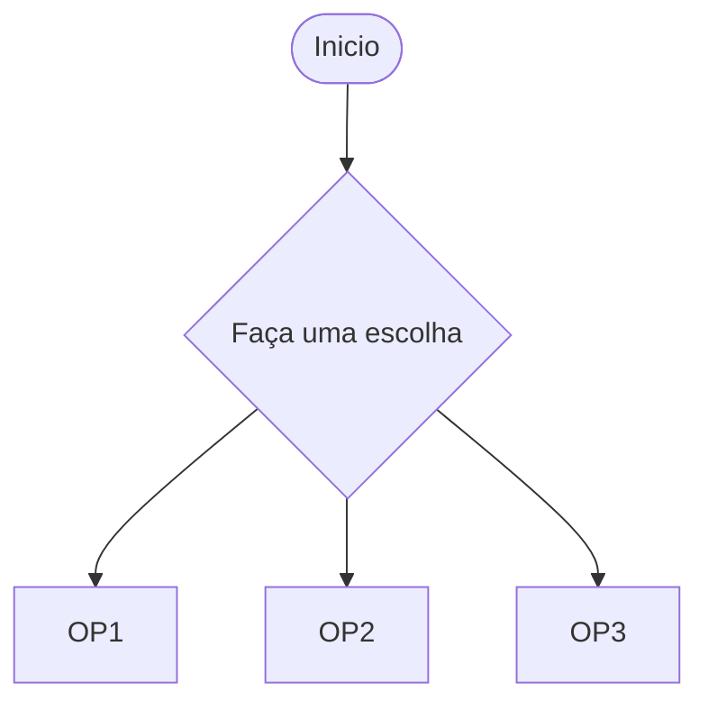
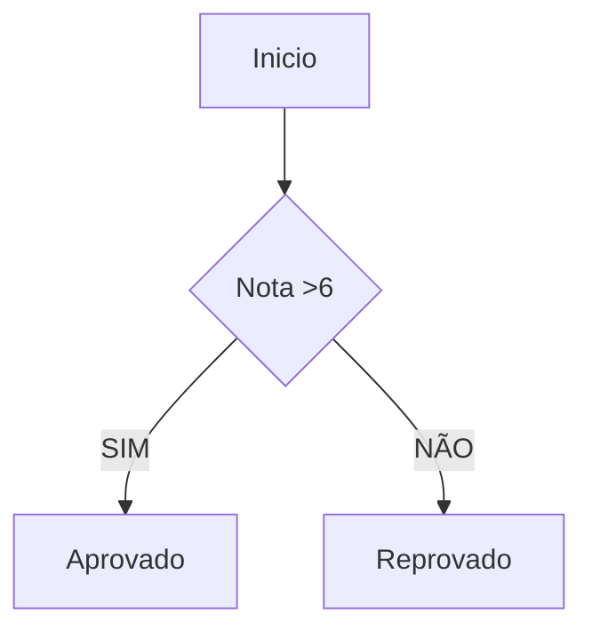

# Grafico-Gannt

```mermaid
flowchart TD

A(["Inicio"])
A--> B{"Faça uma escolha"}
B--> C["OP1"]
B--> D["OP2"]
B--> E["OP3"]
```

```mermaid
graph TD;
A[Inicio]-->B{Nota >6};
B--> |SIM| C[Aprovado];
B--> |NÃO| D[Reprovado];
```
