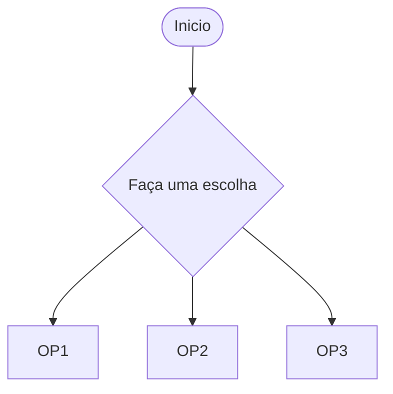
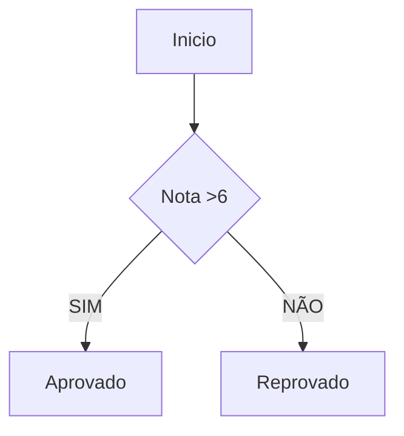
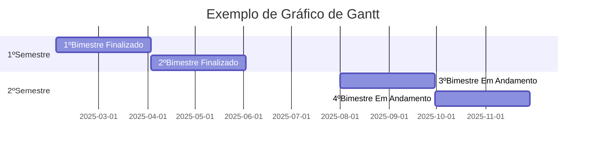

# Grafico-Gannt

```mermaid
flowchart TD

A(["Inicio"])
A--> B{"Faça uma escolha"}
B--> C["OP1"]
B--> D["OP2"]
B--> E["OP3"]
```

```mermaid
graph TD;
A[Inicio]-->B{Nota >6};
B--> |SIM| C[Aprovado];
B--> |NÃO| D[Reprovado];
```

```mermaid
gantt
title Exemplo de Gráfico de Gantt
dateFormat YYYY-MM-DD
section 1ºSemestre
1ºBimestre Finalizado:a1, 2025-02-02, 60d
2ºBimestre Finalizado:a2, after a1, 60d
section 2ºSemestre
3ºBimestre Em Andamento: a3, 2025-08-01, 60d
4ºBimestre Em Andamento:a4, after a3, 60d
```
